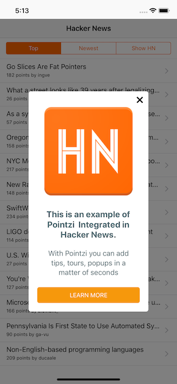
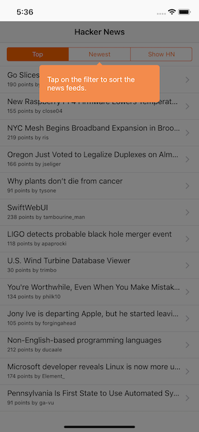

# HackerNews
A Hacker News reader iOS app written in Swift.

# Pointzi

[](https://twitter.com/usepointzi)

## About
This project is maintained by Pointzi and its demonstration how easily you can use Pointzi in your application<br>


## Getting Started

1. `git clone https://github.com/pointzi/HackerNews.git`
2. `cd HackerNews`
3.  Add `pod 'pointzi'` to the Podfile
4. `pod install` (requires [CocoaPods](https://cocoapods.org))
5.  Open `HackerNews.xcworkspace` in Xcode 8.0 or higher.

## Pointzi Integration
Pointzi Integration can be done by following three simple steps:
1. Include `#import <Pointzi/StreetHawkCore_Pointzi.h> ` in your application Bridging header (eg : HackerNews-Bridging-Header.h).
2. Intialize Pointzi SDK in AppDelegate.

    ``` swift
    SHApp.sharedInstance().registerInstall(forApp: "pointzi_dev", withDebugMode: true)
    ```
3. Replace the base viewController class on which you want show Pointzi Widget with

   ```
    If orginal class inherit from UIViewController then replace it with StreetHawkBaseViewController
    If orginal class inherit from UITableViewController then replace it with StreetHawkBaseTableViewController
    If orginal class inherit from UICollectionViewController then replace it with StreetHawkBaseCollectionViewController
   ```

## Screenshots





## License

[MIT](LICENSE)


## Keywords
iOS Swift Slider Infoslider Introslider Whatfix NPS Feedback Goal Goals Analytics Segment Segments Appcues Native Tools Tips

Tours Tips Modals Tool Tipcarousel Tooltips Walkthrough Walkme Guide Bridge Module Pointzi StreetHawk TipsModals Paper onBoard

Tooltiptooltip Tooltip